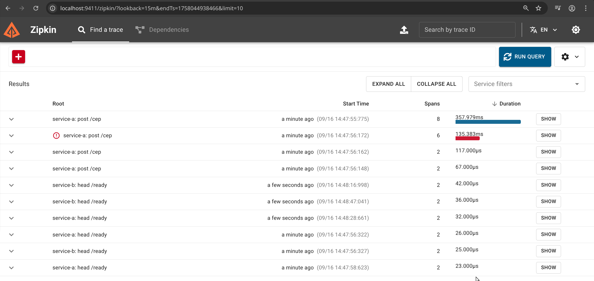

# 🌡️ CEP Temperatura API

Sistema distribuído em Go com OpenTelemetry + Zipkin que recebe um CEP brasileiro e retorna a temperatura atual da cidade em Celsius, Fahrenheit e Kelvin.

## 🏗️ Arquitetura

- **Serviço A**: Validação de entrada e proxy para Serviço B
- **Serviço B**: Orquestração (busca CEP → busca temperatura → conversão)
- **Zipkin**: Tracing distribuído e observabilidade
- **OpenTelemetry**: Instrumentação e coleta de métricas

## 🚀 API Live

**URL**: https://cep-temperatura-667491814881.southamerica-east1.run.app

### Exemplos de Uso

```bash
# Temperatura de São Paulo (via Serviço A)
curl -X POST http://localhost:8080/cep \
  -H "Content-Type: application/json" \
  -d '{"cep":"01310100"}'

# Health checks
curl http://localhost:8080/health  # Serviço A
curl http://localhost:8081/health  # Serviço B
```

## 📋 Requisitos

- Go 1.25+
- Chave da WeatherAPI (obtenha em https://www.weatherapi.com/)

## 🛠️ Instalação e Execução

### Opção 1: Docker Compose (Recomendado)

1. **Clone e configure**
```bash
git clone <repository-url>
cd cep-temperatura
./scripts/dev-setup.sh
```

2. **Inicie os serviços**
```bash
# Iniciar todos os serviços (Service A, Service B, Zipkin)
sudo docker compose up --build

# Ou em background
sudo docker compose up --build -d
```

3. **Verificar status**
```bash
# Ver status dos containers
sudo docker compose ps

# Ver logs em tempo real
sudo docker compose logs -f

# Ver logs de um serviço específico
sudo docker compose logs -f service-a
```

4. **Testar a aplicação**
```bash
# Teste completo da API
./scripts/test-services.sh

# Teste apenas health checks
./scripts/test-health.sh

# Teste HEAD requests (para Docker health checks)
./scripts/test-head-requests.sh
```

### Opção 2: Desenvolvimento Local

1. **Configure o ambiente**
```bash
# Copiar arquivo de exemplo
cp env.example .env

# Editar com sua chave da WeatherAPI
nano .env
```

2. **Instalar dependências**
```bash
go mod tidy
```

3. **Executar os serviços**

**Terminal 1 - Zipkin (Opcional, para tracing)**
```bash
docker run -d -p 9411:9411 --name zipkin-local openzipkin/zipkin
```

**Terminal 2 - Serviço B (Porta 8081)**
```bash
# Com tracing
PORT=8081 go run cmd/service-b/main.go

# Ou sem tracing (mais rápido para desenvolvimento)
PORT=8081 ZIPKIN_ENDPOINT="" go run cmd/service-b/main.go
```

**Terminal 3 - Serviço A (Porta 8080)**
```bash
# Com tracing
go run cmd/service-a/main.go

# Ou sem tracing
ZIPKIN_ENDPOINT="" go run cmd/service-a/main.go
```

4. **Script de execução automática**
```bash
# Executar todos os serviços localmente
./scripts/run-dev.sh
```

## 🧪 Testes

### Testes Unitários
```bash
# Executar todos os testes
go test ./...

# Testes com verbose
go test -v ./...

# Testes de um pacote específico
go test ./internal/services/...

# Testes com cobertura
go test -cover ./...
```

### Testes de Integração

```bash
# Teste completo da API (requer serviços rodando)
./scripts/test-services.sh

# Teste apenas health checks
./scripts/test-health.sh

# Teste HEAD requests (para Docker health checks)
./scripts/test-head-requests.sh

# Teste individual de endpoints
curl -X POST http://localhost:8080/cep \
  -H "Content-Type: application/json" \
  -d '{"cep":"01310100"}'
```

### Testes de Performance
```bash
# Teste de carga simples (requer Apache Bench)
ab -n 100 -c 10 -H "Content-Type: application/json" \
  -p test-data.json http://localhost:8080/cep

# Teste de stress (requer wrk)
wrk -t12 -c400 -d30s -s post.lua http://localhost:8080/cep
```

## 📡 Endpoints

### Serviço A (Porta 8080)

#### POST /cep

Valida CEP e encaminha para Serviço B.

**Request:**
```json
{
  "cep": "01310100"
}
```

**Resposta de sucesso (200):**
```json
{
  "city": "São Paulo",
  "temp_C": 21.4,
  "temp_F": 70.52,
  "temp_K": 294.4
}
```

**Códigos de erro:**
- `422` - CEP inválido (não tem 8 dígitos)
- `404` - CEP não encontrado
- `500` - Erro interno

#### Health Endpoints

- `GET|HEAD /health` - Health check básico
- `GET /health/detailed` - Health check detalhado com dependências
- `GET|HEAD /ready` - Readiness check (pronto para receber tráfego)
- `GET|HEAD /live` - Liveness check (serviço está vivo)

> **Nota**: Os endpoints `/health`, `/ready` e `/live` suportam tanto GET quanto HEAD requests para compatibilidade com health checks do Docker e Kubernetes.

### Serviço B (Porta 8081)

#### GET /temperature/:cep

Busca temperatura para CEP (usado internamente pelo Serviço A).

#### Health Endpoints

- `GET|HEAD /health` - Health check básico
- `GET /health/detailed` - Health check detalhado com dependências
- `GET|HEAD /ready` - Readiness check (pronto para receber tráfego)
- `GET|HEAD /live` - Liveness check (serviço está vivo)

> **Nota**: Os endpoints `/health`, `/ready` e `/live` suportam tanto GET quanto HEAD requests para compatibilidade com health checks do Docker e Kubernetes.

## 🔍 Observabilidade e Tracing

### Zipkin UI
- **URL**: http://localhost:9411
- **Funcionalidades**: 
  - Traces distribuídos entre serviços
  - Análise de latência e performance
  - Mapeamento de dependências
  - Visualização de spans e operações

### Como Visualizar Traces

1. **Acesse o Zipkin UI**
```bash
# Abrir no navegador
open http://localhost:9411
# ou
xdg-open http://localhost:9411
```

2. **Execute uma requisição**
```bash
# Fazer uma requisição para gerar traces
curl -X POST http://localhost:8080/cep \
  -H "Content-Type: application/json" \
  -d '{"cep":"01310100"}'
```

3. **Visualize no Zipkin**
   - Clique em "Run Query" para ver todos os traces
   - Clique em um trace para ver detalhes
   - Analise a timeline e spans individuais

### Demo Visual do Zipkin

A imagem abaixo mostra a interface do Zipkin em ação, exibindo traces distribuídos dos serviços A e B. Você pode ver:

- **Lista de Traces**: Requisições para diferentes endpoints (`/cep`, `/ready`, `/health`)
- **Duração**: Tempo de resposta de cada operação (de 23µs a 357ms)
- **Spans**: Número de operações em cada trace (2 a 8 spans)
- **Status de Erro**: Trace com ícone de exclamação vermelho indicando falha
- **Timeline**: Visualização temporal das operações



**Como interpretar:**
- **Root**: Nome do serviço e endpoint (ex: `service-a: post /cep`)
- **Start Time**: Quando a requisição foi iniciada
- **Spans**: Quantas operações foram executadas no trace
- **Duration**: Tempo total da requisição com barra de progresso visual
- **Ícone de Erro**: Indica traces que falharam ou tiveram problemas

### Spans Implementados

#### Service A (Input Validation)
- **`validate-cep-service-a`**: Validação de formato do CEP
  - Atributos: `cep`, `error` (se inválido)
- **`call-service-b`**: Chamada HTTP para Service B
  - Atributos: `target.service`, `target.url`, `service_b.duration_ms`

#### Service B (Orchestration)
- **`validate-cep`**: Validação de formato do CEP
  - Atributos: `cep`, `error` (se inválido)
- **`fetch-location`**: Busca de localização via ViaCEP
  - Atributos: `cep`, `location.city`, `location.state`, `error` (se falhar)
- **`fetch-temperature`**: Busca de temperatura via WeatherAPI
  - Atributos: `city`, `state`, `weather.duration_ms`, `temperature.celsius`, `error` (se falhar)
- **`convert-temperatures`**: Conversão entre escalas
  - Atributos: `temperature.celsius`, `temperature.fahrenheit`, `temperature.kelvin`

### Métricas de Performance

O sistema coleta automaticamente:
- **Latência**: Tempo de resposta de cada operação
- **Throughput**: Número de requisições por segundo
- **Error Rate**: Taxa de erro por operação
- **Dependencies**: Status de APIs externas (ViaCEP, WeatherAPI)

### Exemplo de Trace Completo

```
POST /cep {"cep":"01310100"}
├── validate-cep-service-a (1ms)
└── call-service-b (150ms)
    └── GET /temperature/01310100
        ├── validate-cep (0.5ms)
        ├── fetch-location (50ms)
        │   └── ViaCEP API call
        ├── fetch-temperature (80ms)
        │   └── WeatherAPI call
        └── convert-temperatures (0.1ms)
```

### Configuração de Tracing

#### Habilitar/Desabilitar Tracing
```bash
# Com tracing (padrão)
ZIPKIN_ENDPOINT="http://localhost:9411/api/v2/spans" go run cmd/service-a/main.go

# Sem tracing (desenvolvimento rápido)
ZIPKIN_ENDPOINT="" go run cmd/service-a/main.go
```

#### Configuração Avançada
```yaml
# configs/config.yaml
telemetry:
  zipkin_endpoint: "http://localhost:9411/api/v2/spans"
  # Para produção, use:
  # zipkin_endpoint: "http://zipkin:9411/api/v2/spans"
```

### Troubleshooting de Tracing

1. **Traces não aparecem no Zipkin**
   - Verifique se o Zipkin está rodando: `docker ps | grep zipkin`
   - Verifique logs: `sudo docker compose logs zipkin`
   - Teste conectividade: `curl http://localhost:9411`

2. **Erro de conexão com Zipkin**
   - Verifique se a URL está correta
   - Para Docker Compose, use: `http://zipkin:9411/api/v2/spans`
   - Para local, use: `http://localhost:9411/api/v2/spans`

3. **Performance impactada**
   - Desabilite tracing em desenvolvimento: `ZIPKIN_ENDPOINT=""`
   - Use sampling em produção (configurável no código)

## 🏗️ Arquitetura

```
internal/
├── handlers/     # HTTP handlers
├── services/     # Lógica de negócio
└── models/       # Estruturas de dados
```

## 🚀 Exemplos Práticos

### Teste Rápido da API

```bash
# 1. Iniciar serviços
sudo docker compose up --build -d

# 2. Aguardar ficarem prontos
sleep 15

# 3. Testar CEP válido
curl -X POST http://localhost:8080/cep \
  -H "Content-Type: application/json" \
  -d '{"cep":"01310100"}' | jq .

# 4. Verificar traces no Zipkin
open http://localhost:9411

# 5. Executar demo interativa
./scripts/demo-api.sh
```

### Comandos Úteis

```bash
# Ver status dos containers
sudo docker compose ps

# Ver logs em tempo real
sudo docker compose logs -f

# Reiniciar apenas um serviço
sudo docker compose restart service-a

# Parar todos os serviços
sudo docker compose down

# Limpar volumes e imagens
sudo docker compose down --volumes --rmi all

# Executar testes
./scripts/test-services.sh

# Verificar health checks
curl -I http://localhost:8080/ready
curl -I http://localhost:8081/ready
```

### Debugging

```bash
# Ver logs detalhados
sudo docker compose logs service-a | grep ERROR

# Entrar no container para debug
sudo docker compose exec service-a sh

# Verificar conectividade entre serviços
sudo docker compose exec service-a wget -qO- http://service-b:8081/health

# Testar API externa
curl "http://api.weatherapi.com/v1/current.json?key=SUA_CHAVE&q=Sao%20Paulo"
```

## 🚀 Deploy

### Deploy Automático (Cloud Build)

```bash
./deploy-cloudbuild.sh SEU_PROJECT_ID
```

### Deploy Manual

```bash
# Build e push
sudo docker build -t gcr.io/SEU_PROJECT_ID/cep-temperatura .
sudo docker push gcr.io/SEU_PROJECT_ID/cep-temperatura

# Deploy
gcloud run deploy cep-temperatura \
  --image gcr.io/SEU_PROJECT_ID/cep-temperatura \
  --platform managed \
  --region southamerica-east1 \
  --allow-unauthenticated \
  --set-env-vars WEATHER_API_KEY=SUA_CHAVE
```

## 🔧 Configuração

### Variáveis de Ambiente

| Variável | Descrição | Padrão | Obrigatória |
|----------|-----------|--------|-------------|
| `PORT` | Porta do servidor | `8080` | Não |
| `HOST` | Host do servidor | `0.0.0.0` | Não |
| `WEATHER_API_KEY` | Chave da WeatherAPI | - | **Sim** |
| `SERVICE_B_URL` | URL do Serviço B | `http://localhost:8081` | Não |
| `ZIPKIN_ENDPOINT` | Endpoint do Zipkin | `http://localhost:9411/api/v2/spans` | Não |
| `WEATHER_BASE_URL` | URL base da WeatherAPI | `http://api.weatherapi.com/v1` | Não |

### Arquivo .env

```bash
# Copiar arquivo de exemplo
cp env.example .env

# Editar com suas configurações
nano .env
```

**Exemplo de .env:**
```env
# Weather API Configuration
WEATHER_API_KEY=your_weather_api_key_here

# Server Configuration
PORT=8080
HOST=0.0.0.0

# Service B Configuration
SERVICE_B_URL=http://localhost:8081

# Telemetry Configuration
ZIPKIN_ENDPOINT=http://localhost:9411/api/v2/spans
```

### APIs Externas

- **ViaCEP**: https://viacep.com.br/ (gratuita)
- **WeatherAPI**: https://www.weatherapi.com/ (requer chave)

## 🐛 Troubleshooting

### Problemas Comuns

#### 1. **Erro 500 - Erro interno do servidor**
```bash
# Verificar logs
sudo docker compose logs service-b | grep ERROR

# Verificar chave da WeatherAPI
curl "http://api.weatherapi.com/v1/current.json?key=SUA_CHAVE&q=Sao%20Paulo"

# Solução: Verificar se WEATHER_API_KEY está correta
```

#### 2. **Erro 422 - CEP inválido**
```bash
# CEP deve ter exatamente 8 dígitos
curl -X POST http://localhost:8080/cep \
  -H "Content-Type: application/json" \
  -d '{"cep":"1234567"}'  # ❌ 7 dígitos

curl -X POST http://localhost:8080/cep \
  -H "Content-Type: application/json" \
  -d '{"cep":"01310100"}'  # ✅ 8 dígitos
```

#### 3. **Erro 404 - CEP não encontrado**
```bash
# Verificar se CEP existe no ViaCEP
curl "https://viacep.com.br/ws/99999999/json/"

# Testar com CEPs conhecidos
curl -X POST http://localhost:8080/cep \
  -H "Content-Type: application/json" \
  -d '{"cep":"01310100"}'  # São Paulo
```

#### 4. **Containers não iniciam**
```bash
# Verificar se portas estão livres
sudo lsof -i :8080
sudo lsof -i :8081
sudo lsof -i :9411

# Liberar portas ocupadas
sudo fuser -k 8080/tcp
sudo fuser -k 8081/tcp
sudo fuser -k 9411/tcp

# Rebuild completo
sudo docker compose down --volumes --rmi all
sudo docker compose up --build
```

#### 5. **Health checks falhando**
```bash
# Verificar se endpoints respondem
curl -I http://localhost:8080/ready
curl -I http://localhost:8081/ready

# Verificar logs de health
sudo docker compose logs service-a | grep health
sudo docker compose logs service-b | grep health
```

#### 6. **Traces não aparecem no Zipkin**
```bash
# Verificar se Zipkin está rodando
sudo docker compose ps | grep zipkin

# Verificar logs do Zipkin
sudo docker compose logs zipkin

# Testar conectividade
curl http://localhost:9411

# Verificar configuração
echo $ZIPKIN_ENDPOINT
```

### Logs Úteis

```bash
# Logs de todos os serviços
sudo docker compose logs -f

# Logs de um serviço específico
sudo docker compose logs -f service-a
sudo docker compose logs -f service-b
sudo docker compose logs -f zipkin

# Logs com filtro de erro
sudo docker compose logs service-a | grep -i error
sudo docker compose logs service-b | grep -i error

# Logs em tempo real com timestamp
sudo docker compose logs -f -t
```

### Comandos de Debug

```bash
# Entrar no container
sudo docker compose exec service-a sh
sudo docker compose exec service-b sh

# Verificar conectividade entre serviços
sudo docker compose exec service-a wget -qO- http://service-b:8081/health

# Verificar variáveis de ambiente
sudo docker compose exec service-a env | grep -E "(WEATHER|ZIPKIN|SERVICE)"

# Testar API externa do container
sudo docker compose exec service-b curl "http://api.weatherapi.com/v1/current.json?key=SUA_CHAVE&q=Sao%20Paulo"
```

## 📜 Scripts Disponíveis

| Script | Descrição | Uso |
|--------|-----------|-----|
| `./scripts/dev-setup.sh` | Configura ambiente de desenvolvimento | `./scripts/dev-setup.sh` |
| `./scripts/run-dev.sh` | Executa serviços localmente | `./scripts/run-dev.sh` |
| `./scripts/test-services.sh` | Testa funcionalidade completa da API | `./scripts/test-services.sh` |
| `./scripts/test-health.sh` | Testa apenas health checks | `./scripts/test-health.sh` |
| `./scripts/test-head-requests.sh` | Testa HEAD requests | `./scripts/test-head-requests.sh` |
| `./scripts/demo-api.sh` | Demo interativa da API | `./scripts/demo-api.sh` |
| `./scripts/rebuild-services.sh` | Rebuild e restart dos containers | `./scripts/rebuild-services.sh` |

### Quick Start

```bash
# 1. Configurar ambiente
./scripts/dev-setup.sh

# 2. Iniciar serviços
sudo docker compose up --build -d

# 3. Executar demo
./scripts/demo-api.sh

# 4. Ver traces
open http://localhost:9411
```

## 📄 Licença

MIT License - veja [LICENSE](LICENSE) para detalhes.